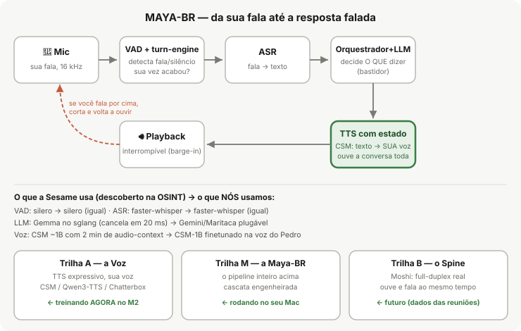

# Arquitetura do Maya-BR (visão macro, 2026-06-10)

**Leitura em uma frase:** a linha de cima é o caminho de uma frase sua — o mic
capta, o VAD/turn-engine decide que sua vez acabou, o ASR vira texto, o
orquestrador+LLM decidem O QUE dizer (bastidor), o **TTS com estado (CSM)**
fala com a SUA voz ouvindo a conversa toda, e o playback é interrompível
(barge-in). Copiamos a Sesame peça por peça (VAD e ASR idênticos — confirmado
por OSINT e pelo podcast do CTO, dossiês 81/82/86); trocamos o LLM (plugável)
e finetunamos o CSM em pt-BR.

| Bloco | Função | Implementação | Equivalente na Maya |
|---|---|---|---|
| VAD + turn-engine | detectar fala, decidir fim de turno, barge-in | `src/duplex/turn_engine.py` (silero) | silero + heurísticas |
| ASR | fala → texto | faster-whisper (`src/duplex/asr.py`) | faster-whisper incremental |
| Orquestrador + LLM | decidir o conteúdo; cancelável | `src/duplex/llm.py` + persona | Gemma no sglang (abort 20ms, JSON constrainado) |
| TTS com estado | texto → voz do Pedro, condicionado no áudio da conversa | CSM via `tts_adapter.py` (≥3 âncoras; adapter LoRA) | CSM ~1B + 2 min de audio-context |
| Playback | tocar com interrupção | `Player` (half-duplex default; barge-in c/ fones) | duplex-aparente |
| Watermark | proveniência do áudio gerado | silentcipher (TODO v0.2) | silentcipher (3 linhas no generate) |

**As três trilhas:** A = a Voz (TTS expressivo finetunado — Colab/M2);
M = este pipeline (cascata engenheirada, nível Maya); B = o Spine (Moshi
full-duplex — substitui a cascata quando os dados das reuniões existirem).
Detalhes, gates e fases: `specs/REPLAN-2026-06-10.md`. Termos: `GLOSSARIO.md`.
